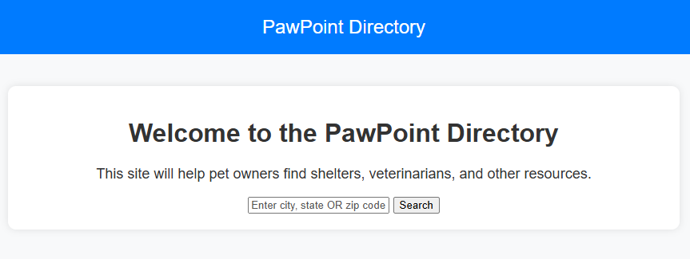

# PawPoint-Directory

PawPoint Directory is a project I decided to start after my cat went missing, which led me to realize there wasn't an easy way to search for vet & shelter contact information. Google searches were time exhaustive and when you're searching for a missing pet, time is critical.  
This is a work in progress, so please bare with me while I continue building out my vision for this directory.

  

## Features  
- Searchable directory by city & state or zip code.
- Integration with Petfinder API for shelter data
- User-friendly interface to locate local resources quickly

## Petfinder API Usage and Terms
This app is powered by Petfinder. The Petfinder API offers users a simple way to access the Petfinder database to obtain details on animal shelters, individual animals, and breed info. It supports up to 1,000 requests per day, with a rate limit of 50 requests/second. To get started, you'll need to request access https://www.petfinder.com/developers/v2/docs/  
> Users must included attribution ("Powered by Petfinder") and comply with API usage restrictions, including non-commerical use of the data feed and data refresh requirements.
> For full details, see the [API Terms of Service](https://www.petfinder.com/api-terms-of-service/)

## License  
This project is licensed under the GNU General Public License v3.0 (GPL-3.0). You can find a copy of the license in the [LICENSE](https://github.com/oliverbebber/PawPoint-Directory/blob/main/LICENSE) file.  
The GPL-3.0 license grants you the freedom to use, modify, and redistribute this software under the condition that any distributed derivative works also carry the same GPL license, ensuring the project and its derivatives remain free and open-source.  
**Note:** While the project code is licensed under GPL-3.0, the Petfinder data feed used within this project is subject to Petfinder's owner Terms of Service, which governs the use of their data.

## Disclaimer  
PawPoint-Directory is provided "as is." We do not guarantee the accuracy or availability of data from Petfinder or any listed organization. Users should verify information independently to ensure accuracy.
